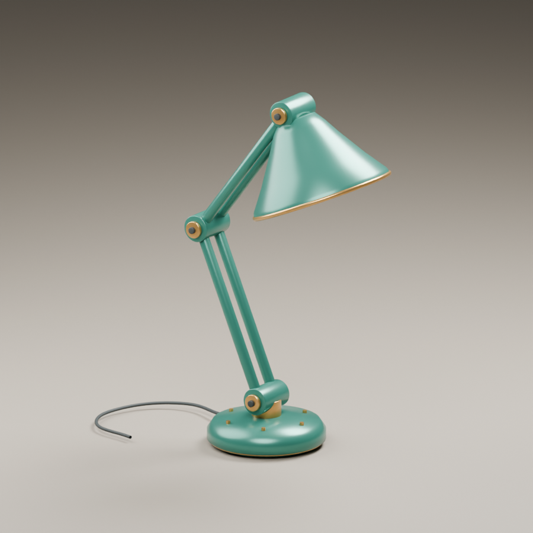

# Blender Astra Skill

Astraが同じBlenderの状態を見ながら、操作・比較・修正を続けるための実用Skill。
Blender 5.2.1で制作、画像比較、GN変更、保存後の再読込まで実行済みです。

**入口: [skills/blender/SKILL.md](skills/blender/SKILL.md)**

## できること

- 追加アドオン・MCP・外部サービスなしで、専用Blenderへ短いPython編集を継続実行。
- 画像中の一点を、評価後の部品・3D位置・法線へ対応付ける。GNインスタンスにも対応。
- カメラのずれと形状のずれを分け、対応点と少数の編集パラメータから補正。
- 部品の見通しを比較し、隠れた細部を確認しやすい視点を選択。
- GNの実際のソケット/APIを調べ、段数・寸法などの意味のある入力を変更。
- 関節、曲線、シェル、インスタンス、生成ソースを保持した成果物を保存。

## 使う

このリポジトリ内ではAGENTS.mdからSkillへ案内されます。ほかの作業で使う場合は
`skills/blender` フォルダを利用環境のSkillディレクトリへ配置するか、入口のパスを指定して読ませてください。
既存Skillを上書きする自動インストーラや、ホスト固有の設定変更は含めていません。

起動・実行コマンドは [runtime.md](skills/blender/references/runtime.md)。
Blender内の機能はbpy/NumPyを使い、画像比較だけはホストPythonのPillow/NumPyを使います。

## 試せる成果物

- [編集可能な .blend](artifacts/blender-skill-examples.blend): 可動ランプと可変棚、生成ソース、接写カメラ。
- [参照との差・修正前](artifacts/reference-before.png) / [修正後](artifacts/reference-after.png)
- [見通しから選んだ電球の接写](artifacts/detail.png)
- [GN変更後の棚](artifacts/shelf.png)
- [実行結果](artifacts/evidence.json) / [判断と限界](docs/RESEARCH.md)

再現する場合はリポジトリrootから新規セッションを起動し、`experiments/run_examples.py`
を実行します。例えばセッションを `.work/reproduction/live` にすると、出力は
`.work/reproduction/blender-skill-examples.blend` です。同梱の成果物は上書きしません。
その後、保存ファイルを再読込して `experiments/readback.py` を実行できます。

公開用の .blend は約185 KBです。自作の2シーンと生成ソースを含み、個人的な参照画像・
外部アセット・ローカルの閲覧履歴を含まない形へ整理し、再読込とGN編集を再確認しました。

## 限界

これは画像一枚から何でも復元する仕組みではありません。対応点や意味のある編集変数は
Astraが選びます。検証は既知の合成参照による補正、製品形状、GN棚が中心で、
実写の自動対応、透明体、未知の裏側、制作水準の人体・リギング、他のBlenderバージョンは未検証です。

NodeCueのMITライセンス付きノードプローブを再利用しています。
[出典・固定commit・ライセンス](skills/blender/scripts/vendor/PROVENANCE.md)を同梱しています。
